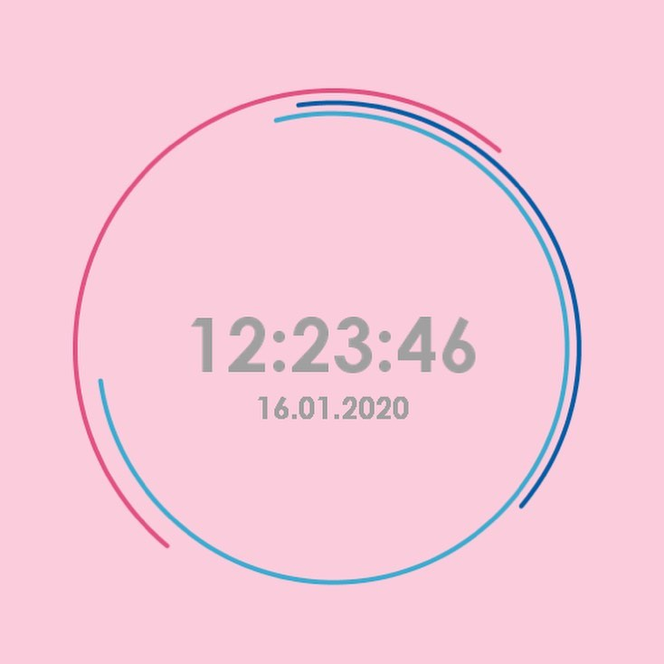
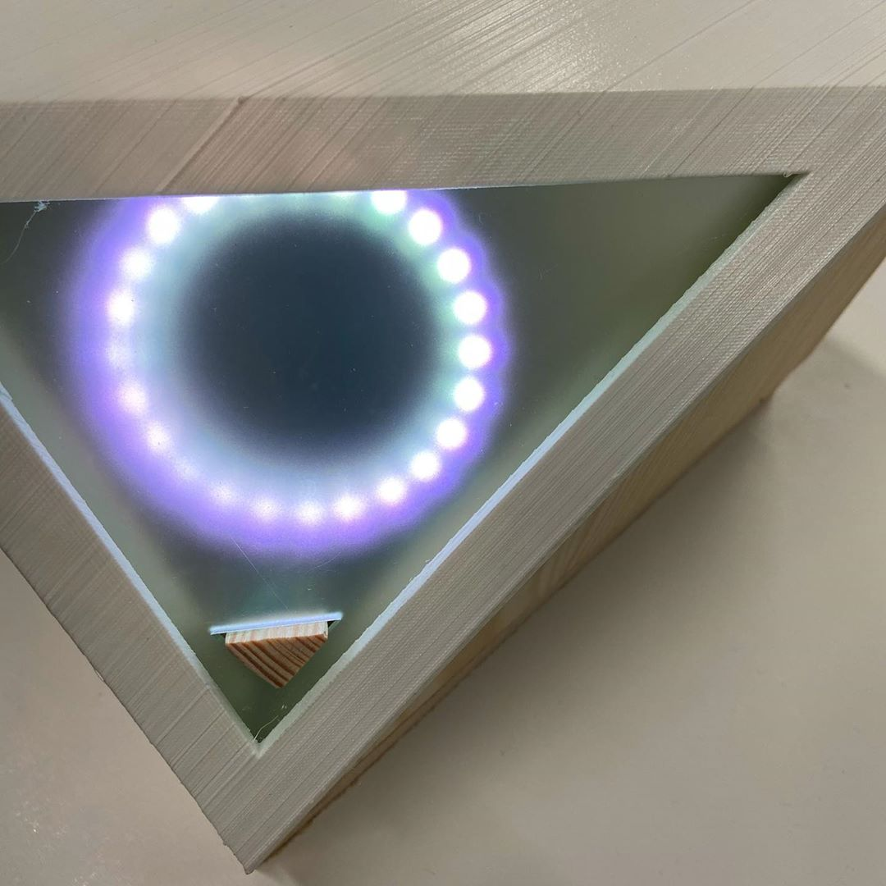

# Coding, Figures, Visuals
## Nick Rothwell

---

# Course Resources

- <!-- .element class="fragment" -->Unit brief on Aula
- <!-- .element class="fragment" -->Submission using Aula
- <!-- .element class="fragment" -->Discussion on Aula: <B>Community</B>
- <!-- .element class="fragment" -->Weekly material (before, after sessions): <B>Journey</B>

---

# This Unit

## Coding, Figures, Visuals

- <!-- .element class="fragment" -->Visual design by coding
- <!-- .element class="fragment" -->(Generative art)
- <!-- .element class="fragment" -->The brief: design and build a clock!

---

# The Project

- <!-- .element class="fragment" -->Software clock - on-screen

 <!-- .element class="fragment" height="40%" width="40%" -->

---

### Next term: physical clock!

 <!-- .element height="40%" width="40%" -->

[Video](https://www.instagram.com/p/B-wVi_nheXU/)<!-- .element class="fragment" -->

---

# Practicalities

- <!-- .element class="fragment" -->Network access
- <!-- .element class="fragment" -->Laptop choice (Mac vs. PC, USB-C, ...)
- <!-- .element class="fragment" -->Laptop and software setup

---

# Teaching Style

- <!-- .element class="fragment" -->Workshopping - worked examples
- <!-- .element class="fragment" -->Not much in terms of notes
- <!-- .element class="fragment" -->Stuff on Aula to play with
- <!-- .element class="fragment" -->Follow-up videos on Loom

---

# P5.js

- <!-- .element class="fragment" -->Images and animation (and interaction) through coding
- <!-- .element class="fragment" --><!-- .element class="fragment" --> A dialect of <A HREF="https://processing.org/">Processing</A>
- <!-- .element class="fragment" -->The Web (browser) as medium
- <!-- .element class="fragment" -->JavaScript
- <!-- .element class="fragment" -->Why are we learning it?
